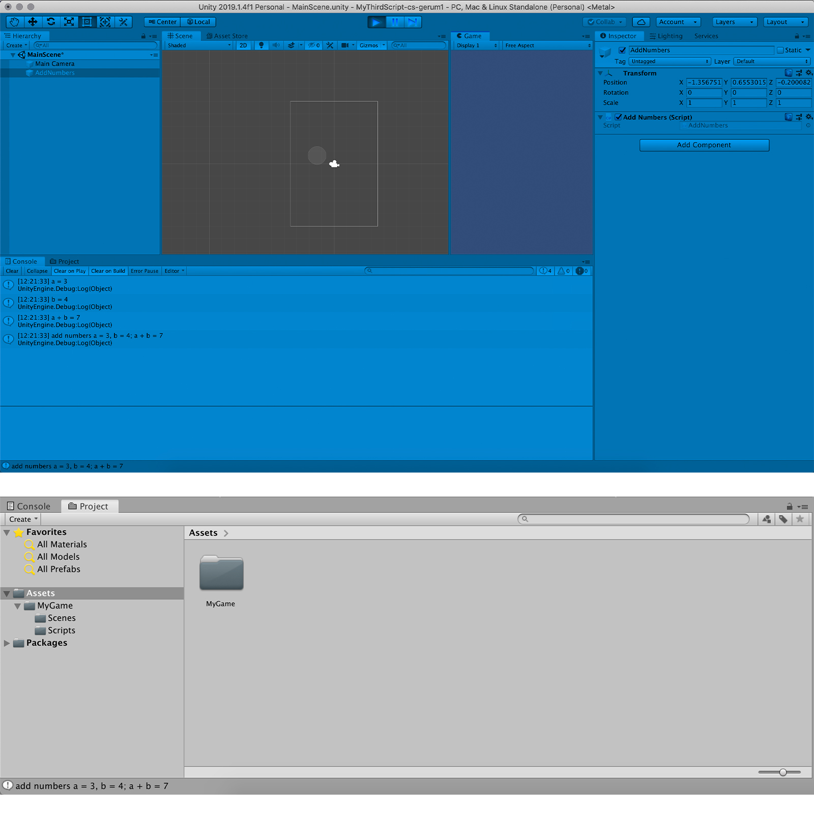

# home-MyThirdScript-cs-smeerws

### Project Description: 

The aim of this project is twofold. 
+ First, it serves practicing the git/GitHub workflow, including writing a meaningful REAMDE. 
+ Second, this is the first time using a debug message with concatinations of strings and variables. 

### Development platform: 

Mac OS Mojave, Unity version 2019.1.14f1, Visual Studio 2017.

### Target platform: 

WebGL (RefRes: 1280x720 HD-720p)  

### Screenshots:

 # MyThirdScript-cs-gerum1

### Lessons Learned

TODO